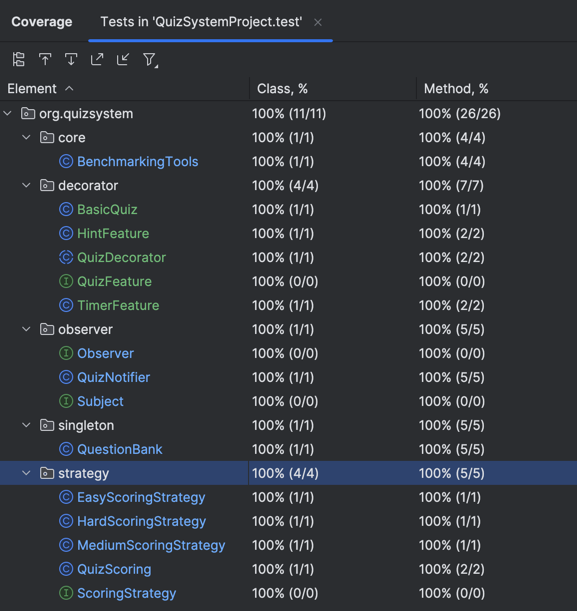

# Performance Implications of Object-Oriented Design Patterns in High-Scale Applications

## Overview
This is a standalone Java application implementing an online quiz system using four key object-oriented design patterns:
- **Singleton**: Centralized question bank and scoring system.
- **Observer**: Notifications for quiz completion.
- **Strategy**: Dynamic scoring algorithms based on quiz difficulty.
- **Decorator**: Optional quiz features like timers and hints.

## Features
1. **Singleton Pattern**:
   - Centralized question bank with eager and lazy initialization.
   - Thread-safe implementation to handle multi-threaded access.

2. **Observer Pattern**:
   - Sends notifications to users and administrators on quiz completion.
   - Scales to thousands of observers with minimal impact on response time.

3. **Strategy Pattern**:
   - Allows dynamic scoring based on difficulty levels.
   - Includes algorithms with increasing complexity (Easy, Medium, Hard).

4. **Decorator Pattern**:
   - Adds optional features like timers, hints, and score multipliers.
   - Modular design for easy customization without altering core functionality.

5. **Benchmarking**:
   - Measures memory usage, CPU cycles, and response time.
   - Includes JVM warm-up to ensure consistent results.
## TestCoverage (100%)


## Benchmarking Methodology
### Singleton Pattern
- Tests eager vs lazy initialization under multi-threaded loads.
- Measures memory usage, CPU cycles, and response times.

### Observer Pattern
- Benchmarks with varying numbers of observers (1, 10, 100, 1000, 10000).
- Tracks memory usage and notification delivery times.

### Strategy Pattern
- Evaluates different scoring algorithms:
  - **Easy**: Simple arithmetic.
  - **Medium**: Array summation.
  - **Hard**: Matrix multiplication.

### Decorator Pattern
- Measures performance impact as features (timers, hints) are layered around the core quiz.

## Expected Results
- Singleton: Minimal differences between eager and lazy initialization.
- Observer: Scales efficiently up to thousands of observers.
- Strategy: Response times grow with algorithm complexity.
- Decorator: Negligible overhead for added features.

## JVM Warm-up
The application includes a JVM warm-up phase to stabilize performance metrics by minimizing Just-In-Time (JIT) optimizations.

### Prerequisites
1. **Java Development Kit (JDK)**:
    - Ensure JDK 17 or higher is installed. Check by running:
      ```bash
      java -version
      ```
      If not installed, download from [Oracle JDK](https://www.oracle.com/java/technologies/javase-downloads.html).

2. **Gradle**:
    - This project uses the Gradle wrapper, so no additional Gradle installation is required.


3. **Environment Setup**:
   - Clone the repository:
     ```bash
     git clone https://github.com/sumanthprasad/OOAD-Project.git
     ```

## Compiling and Running the Application
To compile and run the application:

1. **Clean and Build**:
   ```bash
   ./gradlew clean build

2. **Run the Application**:
   ```bash
   ./gradlew run

3. **Run Tests**
    ```bash
   ./gradlew test
---
